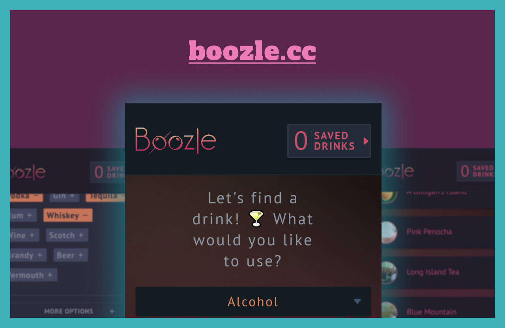

# Boozle - Search Responsibly

A cocktail recipe search app that allows users to find drinks based upon what ingredients they want to use. They can also filter out drinks if there are ingredients they dislike and save drink recipes for later.

## Table of contents

- [Overview](#overview)
  - [Links](#links)
- [My process](#my-process)
  - [Built with](#built-with)
  - [What I learned](#what-i-learned)
  - [Continued development](#continued-development)
- [Author](#author)

### Links

- Live Site URL: [https://boozle.cc](https://boozle.cc)

### Built with

- Mobile-first workflow
- [React](https://reactjs.org/) - JS framework
- [Tailwindcss](https://tailwindcss.com/) - CSS framework
- [Framer Motion](https://www.framer.com/motion/) - React Animation framework 
- [TheCocktailDB](https://www.thecocktaildb.com/api.php) - Cocktail API

### What I learned

This was second React project and it really solidified my grasp of React basics. I learned firsthand the challenges of working with an API (having to workaround questionable design decisions as well as make concessions on certain UI features that would have been untenable because of API structure). I also learned the basics of Framer Motion and was quite happy with how easy it was to add nice feeling animations to my project.

### Continued development

I'd like to try a different workflow where, instead of building all the html, then all the styling, and then converting to React components, I start by building directly in React. This is the workflow that the tools seem to be pushing me and what most React devs do so I want to see firsthand if it's the right approach for me.

I'd also like to get more experience using Framer Motion to make my app feel more alive with smaller animations instead of just transitions.

## Author

- Website - [Jordan Kisiel](https://robojojo.co/)
- Frontend Mentor - [@JordanKisiel](https://www.frontendmentor.io/profile/JordanKisiel)
- Twitter - [@JordanKisiel](https://www.twitter.com/JordanKisiel)
